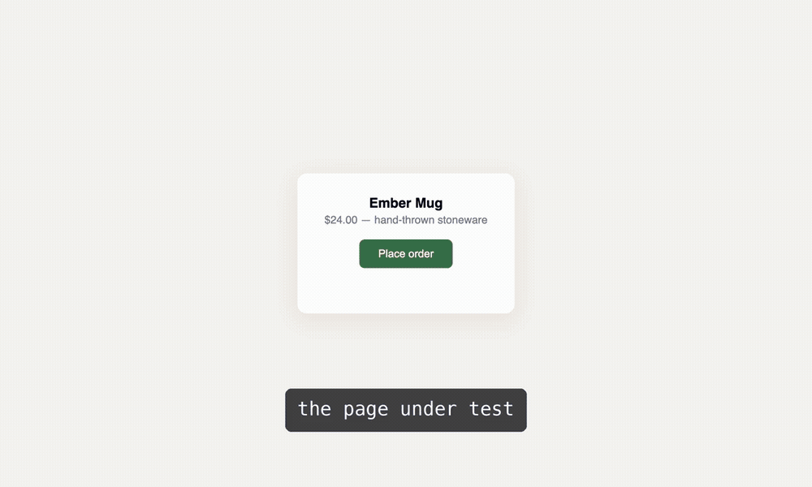
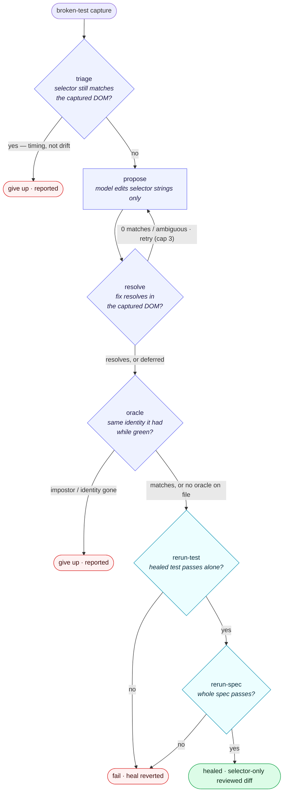

<div align="center">
  <h1>goldseam</h1>
  <p><strong>Bring-your-own-model healing and authoring for Cypress — every repair is a reviewed diff</strong></p>
  <p>A selector breaks. The failure becomes a redacted capture, your model proposes a minimal fix, the suite verifies it, and the repair lands as a git diff you review. Nothing runs in a vendor cloud.</p>

  <br/>

  [](https://github.com/adam-s/goldseam/actions/workflows/ci.yml)
  [](LICENSE)
  [](https://nodejs.org)
  [](https://www.cypress.io)
  [](packages/goldseam/README.md)

  <br/>

  [Full Docs](packages/goldseam/README.md) · [Proving Ground](proving/CAMPAIGN.md) · [Self-Host Recipes](selfhost/) · [Design Notes](.agents/reference/)

  <br/>
</div>

---

## What is goldseam?

goldseam is an **open, bring-your-own-model alternative** to Cypress's Cloud-hosted `cy.prompt()`. You bring the model: the Claude Code CLI you already have (`claude -p`) by default, a local Ollama, any OpenAI-compatible endpoint, or any command-line program. Every result lands as a reviewable file.

```
A selector breaks  →  redacted capture (DOM + aria tree + error)
                   →  your model proposes a minimal selector fix
                   →  a six-rung ladder verifies it
                   →  a one-line diff lands for review
```

Named for [kintsugi](https://en.wikipedia.org/wiki/Kintsugi): the repair is visible, reviewed, and part of the object's story.

### Why goldseam?

| | goldseam | `cy.prompt()` (Cypress Cloud) | Runtime healers |
|---|---|---|---|
| **Where the model runs** | ✅ Your machine or endpoint | ❌ Vendor cloud | ⚠️ Bundled backend |
| **Where the repair lands** | ✅ Reviewed git diff | ❌ Re-resolved at runtime | ❌ Substituted at runtime |
| **Can it weaken assertions?** | ✅ Never — selector strings only | ⚠️ Regenerates steps | ⚠️ Swaps locators silently |
| **Failure honesty** | ✅ Give-up is a first-class, reported outcome | ❌ Confident false greens possible | ❌ Healed ≠ verified |
| **Green runs** | ✅ Untouched, zero writes | — | ⚠️ Instrumented |
| **Open source** | ✅ MIT | ❌ Proprietary | Varies |

---

## Features

- 🩹 **Heal** — A broken selector becomes a one-line reviewed diff; the suite verifies it before it lands
- ✍️ **Author** — Plain-English steps translate once into real Cypress commands, cached as committable files
- 🧠 **Bring Your Own Model** — Claude Code CLI (default), local Ollama, any OpenAI-compatible endpoint, any executable
- 🕵️ **Redacted Captures** — The model sees a redacted DOM + accessibility tree + error, never your application source
- 🪜 **Six-Rung Verification** — Triage, propose, resolve, and oracle judge offline; two rerun rungs re-run the app
- 🏳️ **Honest Give-Ups** — Page never loaded, degraded capture, low confidence: reported, never hidden
- 👻 **Transparent Plugin** — A suite behaves identically with and without goldseam installed
- 📼 **Zero Model Calls in CI** — Authored steps replay from committed cache files in `.goldseam-prompts/`
- 🗂️ **Everything Is a File** — Captures, heals, and translations arrive as reviewable artifacts, never runtime magic

---

## See It Heal

A selector breaks; one command heals it into a one-line reviewed diff (real model, real run, 68 seconds):


---

## Quick Start

### 1. Install

```bash
npm install --save-dev goldseam
npx goldseam init
```

That's the whole integration. Green runs are untouched; failures write capture artifacts to `.goldseam/failures/`.

### 2. Heal

```bash
npx goldseam heal          # propose + verify a fix for every capture
git diff                   # review the selector-only edit, then commit
npx goldseam report        # per-test summary of captures and heals
```

### 3. Author

```ts
cy.visit('/shop');
cy.goldseam([
  'Add the Ember Mug to the cart',
  'The cart count should show 1',
]);
```

Steps translate once through your model into a fixed command vocabulary (never `eval`'d code), cached in a committable `.goldseam-prompts/` file that replays in CI with zero model calls:



---

## How a Heal Is Verified

Every heal passes a six-rung ladder. Triage, propose, resolve, and oracle judge offline against the captured DOM; the two rerun rungs re-run the app; give-up and fail are first-class, never hidden:



A heal can only ever change selector strings, and gives up loudly when a fix would be a lie.

---

## Models

| Runner | Flag | Where it runs |
|--------|------|---------------|
| **Claude Code CLI** | `claude` (default) | Your machine, via the `claude -p` you already have |
| **Ollama** | `ollama:<model>` | Local, zero egress — proven end-to-end on a 14B Qwen |
| **OpenAI-compatible** | `openai:<model>` | Any endpoint — proven against real OpenAI; self-host on your own GPU with the [Modal recipe](selfhost/modal/README.md) |
| **Any executable** | `cmd:<executable>` | Prompt in on stdin, reply out on stdout |

Shared model choice and defaults live in an optional `goldseam.config.mjs`, read by both the CLI and the plugin.

---

## Why Two Tools Instead of One Self-Healing Prompt?

That merged loop is what `cy.prompt()` markets. When a plain-English step breaks you can't tell whether the app regressed, the sentence was too vague, or a re-resolve would land on a plausible-but-wrong look-alike — merged, those compound into a confident false green. Kept separate, the failure modes stay separable and each tool stays trustworthy. Full reasoning: [authored-self-healing.md](.agents/reference/authored-self-healing.md).

---

## Repository Layout

| Path | What lives there |
|------|------------------|
| [`packages/goldseam/`](packages/goldseam/) | The plugin + CLI — full options, artifact schema, model runners, and guarantees |
| [`packages/aria-snapshot/`](packages/aria-snapshot/) | Playwright's aria snapshot + targeting utilities as a standalone package ([npm](https://www.npmjs.com/package/aria-snapshot)) |
| [`demo/`](demo/) + [`cypress/`](cypress/) | The fixture shop and the dogfood suite |
| [`proving/`](proving/) | Real apps, induced drift, real heals ([receipts](proving/CAMPAIGN.md)) |
| [`.agents/reference/`](.agents/reference/) | Design references |

---

## Develop

Node 22+.

```bash
git clone https://github.com/adam-s/goldseam && cd goldseam
npm install
npm run build:packages
npm run test:unit && npm run test:system && npm run test:hardening && npm run test:heal
```

---

## License

[MIT](LICENSE) — `aria-snapshot` is Apache-2.0 with NOTICE.

---

<div align="center">
  <p>Named for <strong><a href="https://en.wikipedia.org/wiki/Kintsugi">kintsugi</a></strong> — the repair is visible, reviewed, and part of the object's story.</p>
  <p><sub>Never hidden magic. 🏺</sub></p>
</div>
