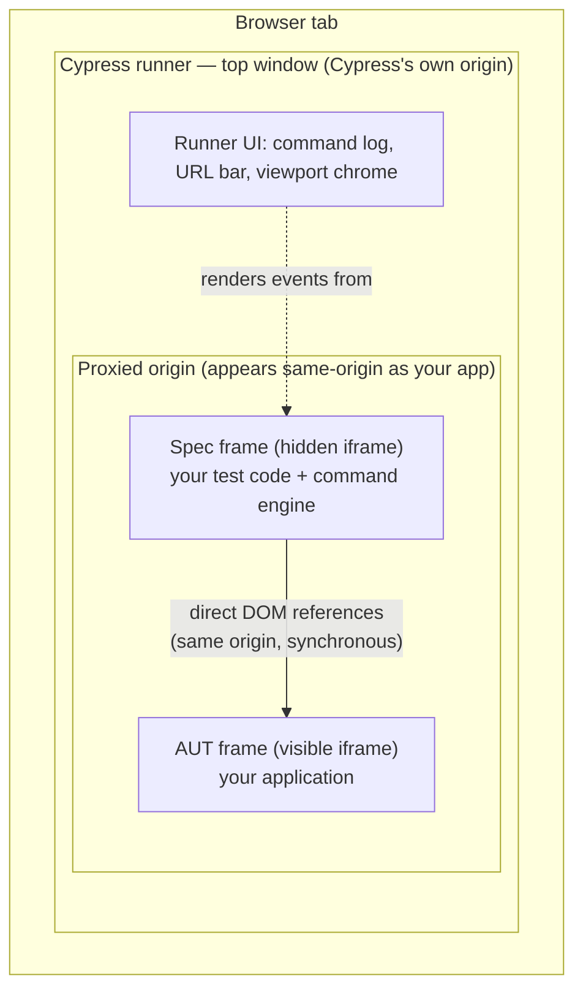
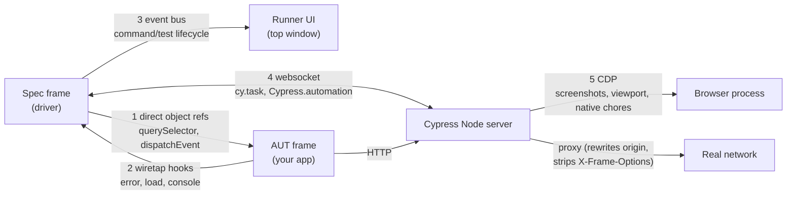
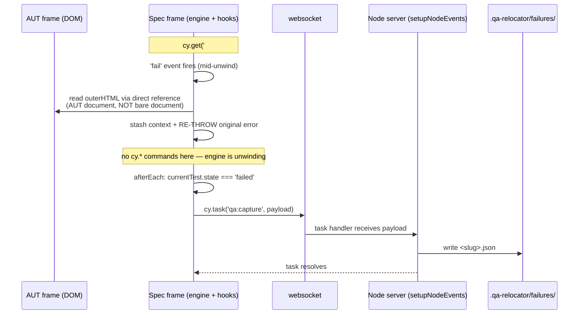
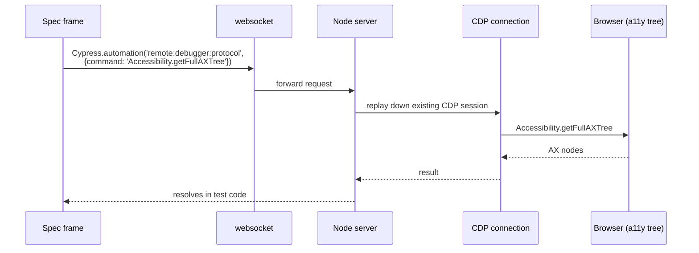

# Cypress architecture — how the pieces talk

Reference for qa-relocator M1/M2. Four views: frame anatomy, comms
channels, the M1 capture pipeline, and the M2 CDP borrow.

## 1. Frame anatomy — who lives where

- **AUT** = Application Under Test (your app).
- The proxy rewrites all app traffic so spec + AUT share an origin — that's
  what makes direct cross-frame DOM access legal.
- Two `window`s / two `document`s: bare `document` in spec code is the
  **spec frame's**, not the app's. `cy.window()` / `Cypress.$` point at the AUT.
- How the spec frame gets its URL (and why it shares the app's origin):
  see [spec-frame-url.md](spec-frame-url.md).

## 2. Communication channels

| # | Link | Mechanism | Nature |
| --- | ---- | --------- | ------ |
| 1 | spec → AUT | direct JS references | synchronous, no messaging |
| 2 | AUT → spec | planted listeners | app doesn't know it's observed |
| 3 | spec → runner UI | event stream | `Cypress.on('fail')` subscribes here |
| 4 | spec ↔ server | websocket | only exit from the browser |
| 5 | server → browser | CDP | management side-channel, Chromium |

## 3. M1 — failure-capture pipeline

Rules encoded in this diagram:

- **Stash + re-throw** in `fail` — never swallow, never enqueue commands.
- Capture is **best-effort**: any capture error must not mask the original failure.
- The stash lives only as long as the current test — durable record is Node's job.
- Green runs write nothing.

## 4. M2 — borrowing the server's CDP session

Trade-off to justify in M2: this "live borrow" is Chromium-only and rides
semi-documented plumbing, vs. offline extraction (rehydrate captured DOM in a
headless page later) which runs in the repair harness, outside the failure
window. Either way the AX tree complements the DOM capture — the agent picks
the target semantically from the tree, but expresses the selector against the DOM.
