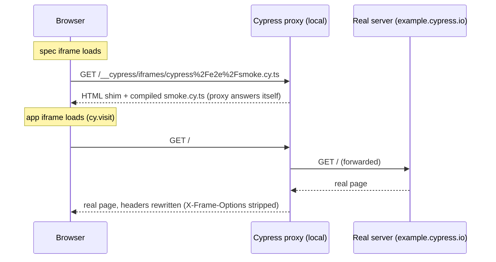
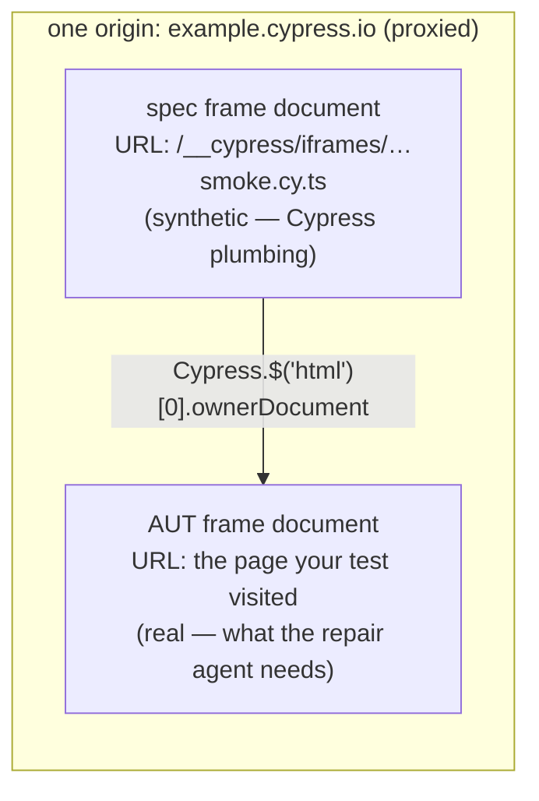

# Why the spec frame's URL looks like that

While paused inside a `fail` handler, `document.location.href` (the **spec
frame's** URL) came back as:

```text
https://example.cypress.io/__cypress/iframes/cypress%2Fe2e%2Fsmoke.cy.ts?browserFamily=chromium
```

Decoded:

| Piece | Meaning |
| ----- | ------- |
| `https://example.cypress.io` | The **app's** origin — worn as a mask by Cypress's proxy |
| `/__cypress/iframes/…` | Path namespace **reserved by the proxy**; never reaches the real site |
| `cypress%2Fe2e%2Fsmoke.cy.ts` | URL-encoded `cypress/e2e/smoke.cy.ts` — which spec to load |

## The simple version

The spec frame is an iframe, and an iframe needs a `src`. Cypress makes the
`src` a URL that names the spec file, like a route parameter. When the
browser requests it, Cypress's proxy answers directly (never contacting the
real server) with a small HTML page that loads your compiled spec + the
Cypress driver.

Crucially, that page is served **under your app's origin** — just on a
reserved path. Same origin = the browser allows the spec frame to reach into
the app frame's DOM. That's the entire trick that makes `cy.get` possible.

## Who answers which request



Same origin from the browser's point of view, two very different answers:
`/__cypress/*` is Cypress talking to itself; everything else is your app,
relayed and lightly rewritten.

## Why it matters for capture (M1)

There are two documents, with two URLs:



Bare `document` in support-file code is the spec frame's — capture its
`location.href` and the failure record claims the test failed on a page that
doesn't exist. Walk `Cypress.$('html')[0].ownerDocument` to reach the AUT's
document, whose `location.href` and `documentElement.outerHTML` are the real
`url` and `domHtml` for the capture JSON.
